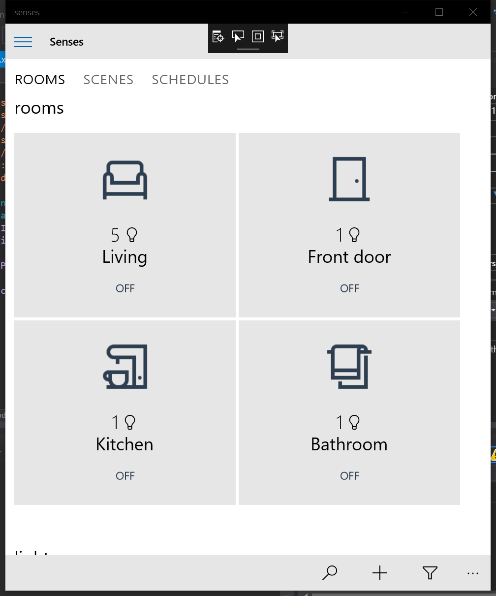

# senses
UWP app to control Philips Hue devices

This is a work in progress.

## screenshot

## Libs
The app uses [Q42/Q42.HueApi](https://github.com/Q42/Q42.HueApi)
and the [official documentation](http://www.developers.meethue.com/documentation/getting-started)
